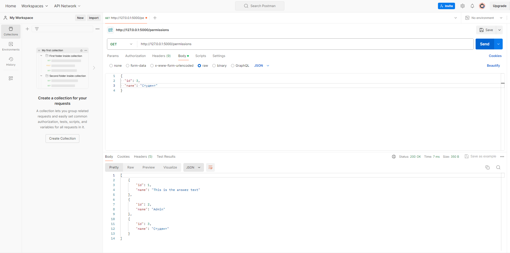
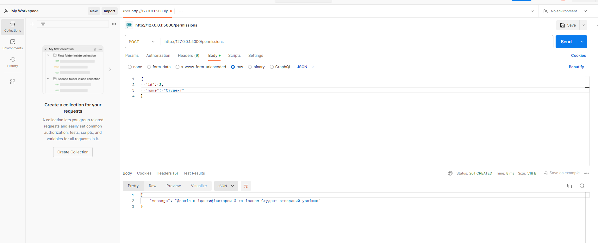
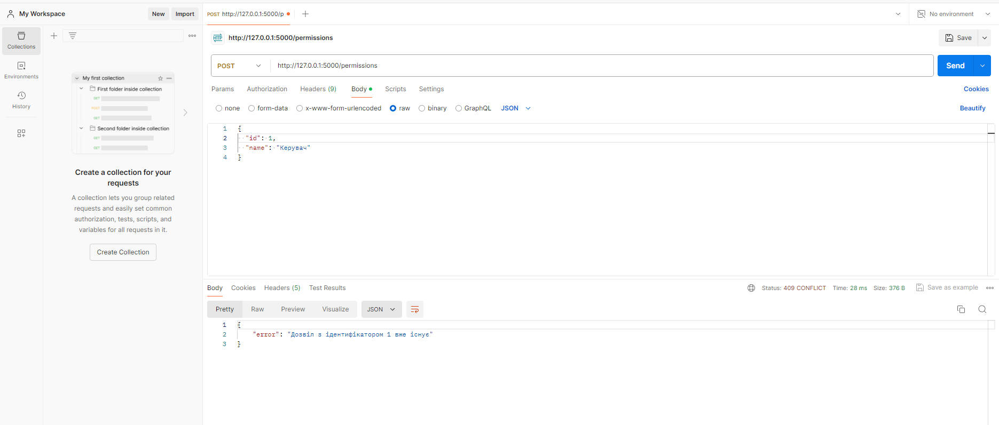
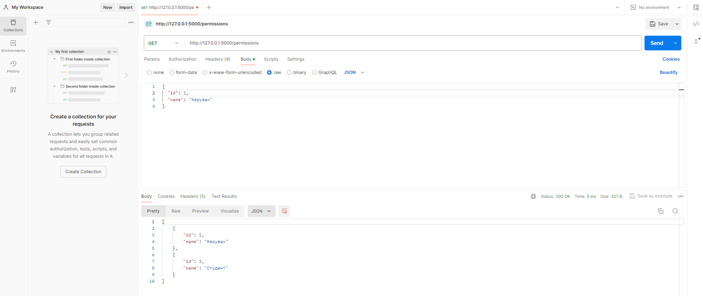

# Тестування працездатності системи

## Засоби тестування
Тестування CRUD застосунку проводиться за допомогою online Postman.

Примітка: Перед цим необхідно інсталювати Postman Agent, щоб тестувати запроси на локальному сервері.

### Отримання інформації по всім Permissions

### Створення нового Permission

#### Помилка створення permission по причині: "Ідентифікатор вже зайнятий"

### Видалення permission

### Вміст таблиці 'Permissions' у базі 'quiz' даних після видалення permission

